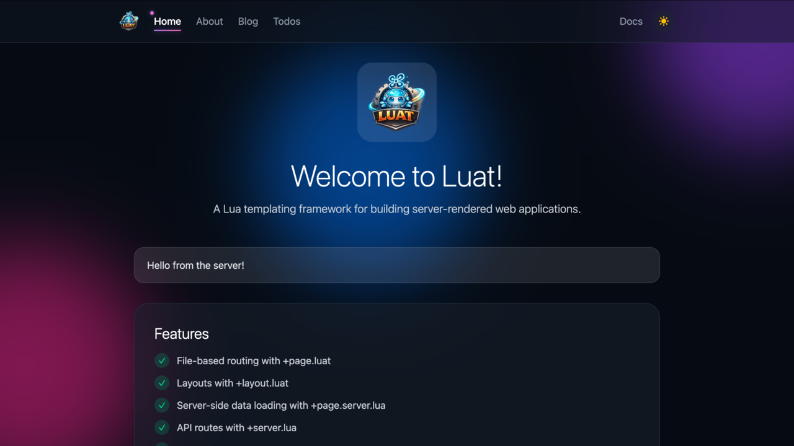

<p align="center">
  
</p>

<p align="center">
  Svelte-inspired server-side Lua templating for Rust.
</p>

<p align="center">
  <a href="https://crates.io/crates/luat"></a>
  <a href="https://docs.rs/luat"></a>
  <a href="https://github.com/maravilla-labs/luat/actions/workflows/ci.yml"></a>
  <a href="LICENSE-MIT"></a>
</p>

<p align="center">
  <a href="https://luat.maravillalabs.com/">Website</a> •
  <a href="https://luat.maravillalabs.com/docs/getting-started">Getting Started</a> •
  <a href="https://luat.maravillalabs.com/docs/templating/syntax">Syntax Guide</a> •
  <a href="https://github.com/maravilla-labs/luat-tools">Editor Support</a>
</p>

---

> ⚠️ **Early Release** - This is the first public release of Luat. The API is still evolving and not yet production-ready. Feedback and contributions are welcome.

<p align="center">
  
</p>

## Features

- **Svelte-like syntax** - Familiar `{#if}`, `{#each}`, components, and expressions
- **Server-side rendering** - Pure SSR with no client hydration overhead
- **Component system** - Reusable components with props and children
- **Lua-powered** - Templates compile to Lua for fast execution
- **CLI with live reload** - Development server with automatic browser refresh

## Installation

```bash
# npm (recommended)
npm install -g @maravilla-labs/luat

# Shell script (Linux/macOS)
curl -fsSL https://raw.githubusercontent.com/maravilla-labs/luat/main/scripts/install.sh | sh

# Cargo (Rust developers)
cargo install luat-cli
```

## Quick Start

```bash
luat init my-app
cd my-app
luat dev
```

## Example

```html
<!-- HomePage.luat -->
<script>
    local Card = require("components/Card")
    local title = "Welcome to LUAT"
    local subtitle = "Build dynamic web applications"
</script>

<div class="homepage">
    <Card title={title} subtitle={subtitle} />
</div>
```

For the full syntax guide, see the [documentation](https://luat.maravillalabs.com/docs/templating/syntax). There's also a [live playground](https://luat.maravillalabs.com/playground) to try Luat in your browser.

## Documentation

- [Getting Started](https://luat.maravillalabs.com/docs/getting-started)
- [Template Syntax](https://luat.maravillalabs.com/docs/templating/syntax)
- [Project Structure](https://luat.maravillalabs.com/docs/application/structure)

## Editor Support

Get syntax highlighting, diagnostics, and autocomplete for `.luat` files:

- **VSCode Extension** - Full language support with LSP integration
- **LSP Server** - Works with any LSP-compatible editor (Neovim, Helix, etc.)

See [luat-tools](https://github.com/maravilla-labs/luat-tools) for installation instructions.

## Contributing

Contributions are welcome! Please see [CONTRIBUTING.md](CONTRIBUTING.md) for guidelines.

## License

Licensed under either of [Apache-2.0](LICENSE-APACHE) or [MIT](LICENSE-MIT) at your option.

## Credits

Created and maintained by [Maravilla Labs](https://maravilla-labs.com).
